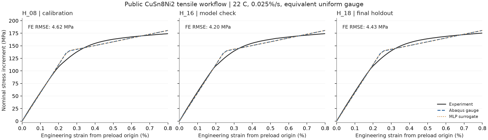
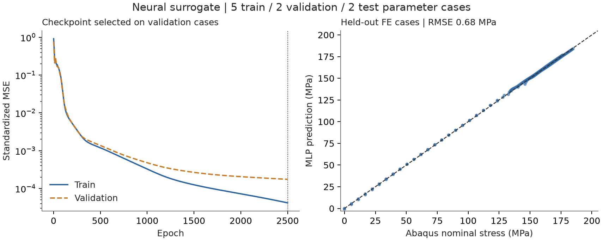

# 公开拉伸数据到 FE 与神经网络的完整案例

本次用 KupferDigital 的 CuSn8Ni2 拉伸数据完成了
**实验读取 → 材料标定 → INP → Abaqus 求解 → ODB → HDF5/NPZ → MLP 训练 → 留出评估**。
12 个小型 FE 算例共完成 84 个流水线阶段，训练模型、预测结果和对照图均已保存。

## 实验与模型

数据来自 [KupferDigital version 2](https://doi.org/10.5281/zenodo.10820299)，许可为 CC-BY-4.0。
同组试样 H_08 用于标定，H_16 用于模型检查，H_18 用于最终实验评估。
三个试验温度均为 22°C，标距 25 mm。H_08/H_18 的初始截面积为 19.679 mm²，
H_16 为 19.643 mm²。来源说明的材料表、拉伸方法、Fig. 1 和 Table 5 已核对。

本案例取原始曲线首点作为预载原点，保留严格递增的初始加载子序列，
在固定应变网格上插值。比较范围为 0–0.8% 工程应变，处于 0.025%/s 的加载阶段。
源行及转换规则记录在本地 `source-records.json`。

FE 使用保持截面积和标距的等效方形均匀标距段，采用小应变双线性各向同性弹塑性。
这是面向轴向均匀响应的模型简化。截面积、长度、坐标定义和泊松比均在配置中声明。
材料区域采用独立映射，晶体取向的适用性记为“均质各向同性模型不适用”。

| 参数 | 值 | 来源 |
|---|---:|---|
| 有效弹性模量 E | 56.2 GPa | H_08 原文件的弹性段斜率 |
| 双线性模型初始屈服应力 | 139.03 MPa | H_08 固定窗口拟合 |
| 线性塑性硬化模量 | 8.670 GPa | H_08 固定窗口拟合 |
| 泊松比 | 0.30 | 建模取值，另检查 0.25/0.35 |

上述屈服参数是双线性模型的识别值。原始数据中的 Rp0.2 保留其偏移屈服强度定义。
应力比较采用从预载原点起算的名义应力增量，单位 MPa。

## 真实求解与数值检查

九个参数案例覆盖标定参数附近的三个独立变化方向，各参数变化范围为 ±10%。
另有两个泊松比敏感性案例和一个八单元网格案例。普通案例使用一个 C3D8 单元，
网格检查使用八个 C3D8 单元。每次求解使用一个 CPU，执行中最多同时运行两例。

每例完整执行 validate、build-inp、datacheck、analysis、extract-odb、export-hdf5 和 export-npz。
每个真实 ODB 提取 41 个状态，保留 S、E、U 和 RF。顶面 RF3 求和后除以初始面积，
得到名义轴向应力，顶面平均 U3 除以标距得到工程应变。

12 例均通过预先设定的单轴解析响应检查，最大 NRMSE 为 **3.89×10⁻⁶**。
顶面和底面反力平衡通过复核。泊松比与八单元检查的轴向曲线在已保存精度下重合。
泊松比变化对应的横向位移分别变化，符合该自由侧向变形模型的预期。

## 神经网络与独立评估

网络为两层各 32 个隐藏单元的 MLP，使用 Tanh 激活，输入为工程应变、E、屈服应力和
塑性硬化模量，输出为名义轴向应力。训练、验证、测试分别使用 5/2/2 个参数案例。
每例 41 个 FE 状态插值为 81 个点，得到 405/162/162 行。完整案例保持在同一分组。

归一化统计来自训练集。固定随机种子 42，训练 2,500 轮，由验证误差选取模型。
本次最佳模型位于第 2,500 轮。单线程 CPU 优化耗时约 1.53 秒，另有导入、整理和保存开销。

| 比较 | RMSE | NRMSE |
|---|---:|---:|
| MLP 对留出 FE 案例 | **0.682 MPa** | **0.369%** |
| 训练集均值基线对留出 FE 案例 | 49.51 MPa | 26.79% |
| 标定 FE 对 H_18 实验 | **4.428 MPa** | **2.527%** |
| MLP 对 H_18 实验 | **4.477 MPa** | **2.555%** |
| H_16 与 H_18 实验曲线差异 | 0.842 MPa | 0.483% |

NRMSE 定义为 RMSE 除以对应参考应力序列的最大绝对值。实验比较在共同的 161 点应变网格上进行。
FE 与实验的较大差异集中在约 0.24% 应变的屈服过渡段，H_18 上最大差异为 11.49 MPa。
这为后续改善宏观硬化模型提供了明确的比较位置。

## 对照图与数值结果

图中的实验曲线根据 H. Beygi Nasrabadi 等人的 KupferDigital 数据加工，
包括预载原点平移、固定窗口选择和插值。原数据采用
[CC BY 4.0](https://creativecommons.org/licenses/by/4.0/) 许可。
FE 与 MLP 曲线来自本项目的对应运行。上述数据来源说明适用于这组案例材料。

[结构化结果](assets/public-tensile-20260906/summary.json)保留比较指标、分组和模型范围，
[基准 INP](../../examples/kupfer_tensile/reference/base.inp)对应本次完成的标定案例。

## 软件交付与复跑

新增可复用的标定、均匀标距段配置、轴向 ODB 汇总及 MLP 训练接口，
并扩展材料区域、取向适用性和 `isotropic_plastic` 求解契约。
`pipeline train-surrogate` 支持以 NPZ 数据和显式字段定义运行训练。

项目 `.venv` 最终离线测试为 **466 passed，2 skipped，26.01 秒**。
构建生成一个 wheel 和一个 sdist，安装验证 **1 passed，6.18 秒**。
真实案例单独复核了 12 个 INP/ODB、HDF5/NPZ 往返、84 个阶段、反力平衡和模型读回。
在记录的单线程设置下，载入 checkpoint 得到相同预测。

完整复跑入口位于 [examples/kupfer_tensile](../../examples/kupfer_tensile/README.md)。
准备脚本已再次执行，并确认所有案例的参数及分组与本次运行一致。
本地结果位于 `runs/tensile-surrogate-20260906/`，包括模型配置、真实求解产物、
`evaluation.json`、`experimental-comparison.csv`、模型文件及 PNG/SVG 图。
